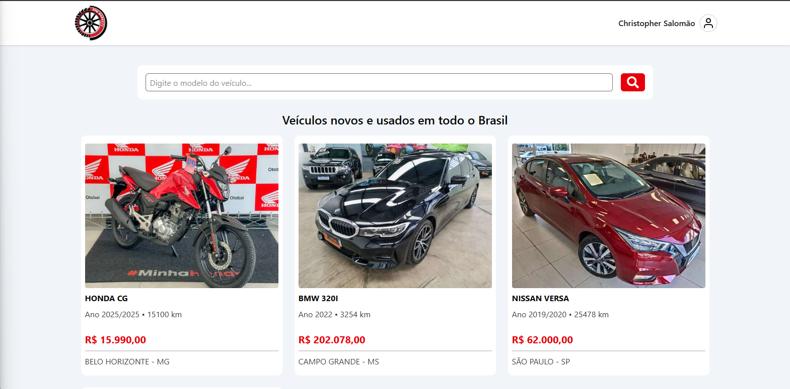
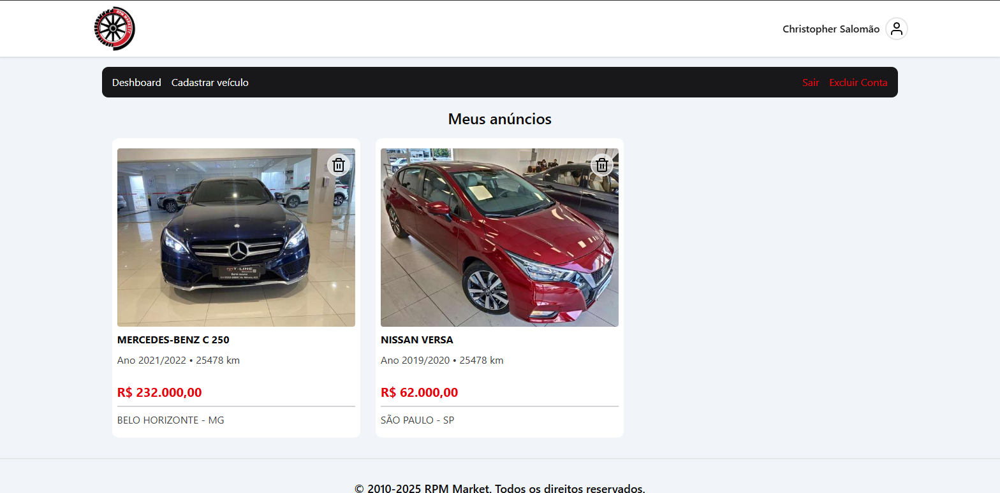
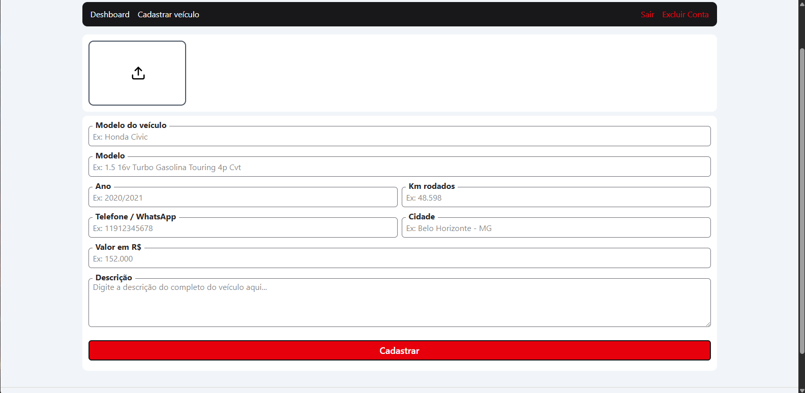
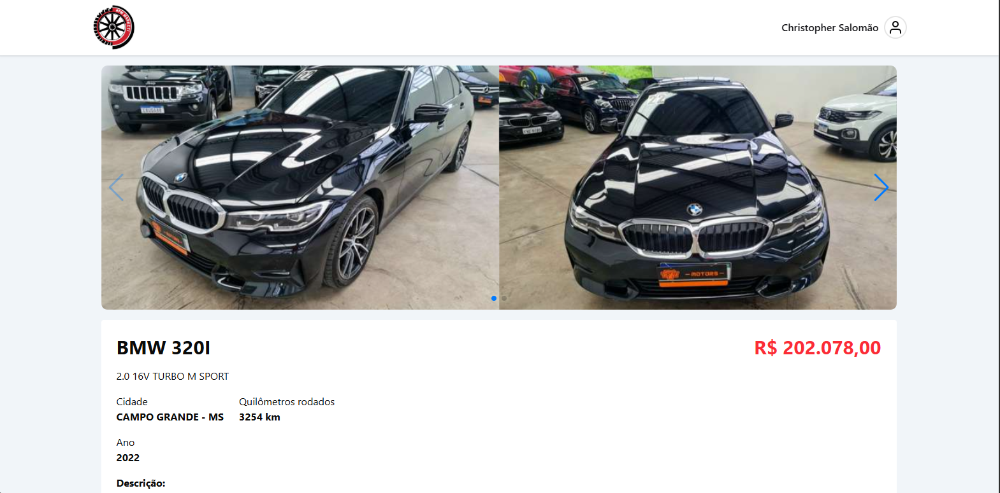

# 🚗 RPM Market

Um marketplace fictício de compra e venda de veículos, desenvolvido como parte de um curso.
Além das funcionalidades originais, o projeto recebeu algumas melhorias visuais e de experiência do usuário.

## 🛠 Tecnologias Utilizadas

- **[Vite](https://vitejs.dev/)** – Build tool rápida para desenvolvimento moderno
- **[React](https://react.dev/)** – Biblioteca para construção da interface
- **[TypeScript](https://www.typescriptlang.org/)** – Tipagem estática para mais segurança no código
- **[Firebase](https://firebase.google.com/)** – Autenticação e banco de dados em tempo real
- **[Tailwind CSS](https://tailwindcss.com/)** – Estilização rápida e responsiva
- **[React Hook Form](https://react-hook-form.com/)** – Gerenciamento de formulários e validações de forma simples e eficiente
- **[Zod](https://zod.dev/)** – Validação de esquemas e tipagem segura
- **[React Router](https://reactrouter.com/)** – Navegação entre páginas da aplicação
- **[React Icons](https://react-icons.github.io/react-icons/)** – Ícones prontos para usar na interface
- **[shadcn/ui](https://ui.shadcn.com/)** – Componentes acessíveis e estilizados

## ✨ Diferenças em relação ao projeto original

- **Identidade visual aprimorada** – ajustes na interface para um layout mais limpo e atrativo
- **Nome e logo próprios** – agora chamado **RPM Market**, com identidade visual personalizada
- **Confirmação de ações importantes** – uso do `Dialog` do shadcn/ui para confirmar logout ou exclusão de conta
- **Mensagem de erro personalizada** – alerta amigável quando o usuário tenta buscar um veículo que não está à venda
- **[Zustand](https://zustand-demo.pmnd.rs/)** – Gerenciamento de estado leve e simples

## 🔗 Repositório da versão com Context API

Se quiser conferir a versão original do projeto usando **Context API**, acesse:
[Repositório RPM Market – Context API](https://github.com/christopher-salomao/rpm-market.git)

## 📸 Preview






## 🚀 Como executar

1. **Clone o repositório:**
   ```bash
   git clone https://github.com/christopher-salomao/rpm-market-zustand.git
   ```
2. **Acesse a pasta do projeto:**
   ```bash
   cd rpm-market
   ```
3. **Instale as dependências:**
   ```bash
   npm install
   ```
4. **Modifique o arquivo `firebaseConnection.ts` com suas credenciais do Firebase**
5. **Inicie o servidor de desenvolvimento:**
   ```bash
   npm run dev
   ```
6. **Abra o navegador e acesse:**
   ```
   http://localhost:5173
   ```
